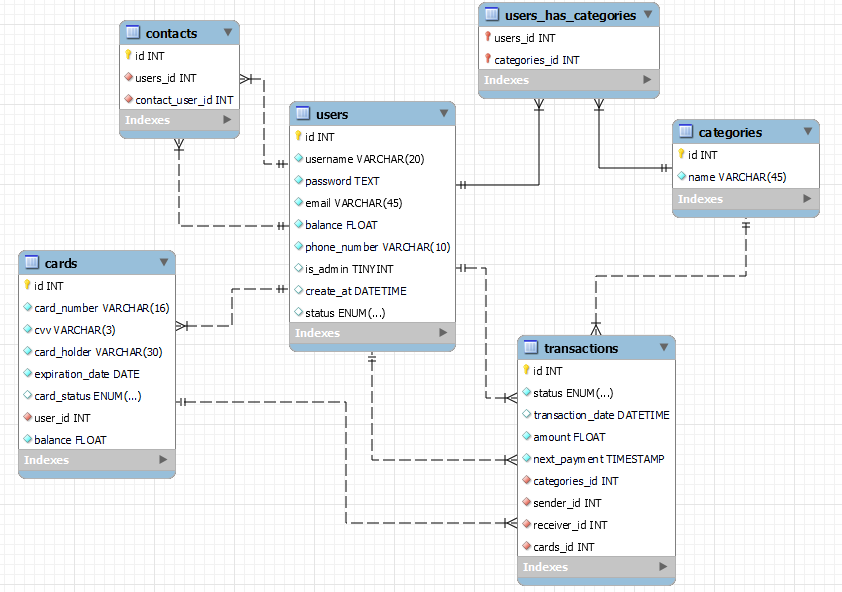

# Virtual Wallet

**Virtual Wallet** is a comprehensive web application designed to simplify and enhance your financial management. With Virtual Wallet, you can easily manage your budget, send and receive money, and keep track of your finances all in one place.


## Features ✨

### User Management
- **Registration & Login**: Users can register and log in with a unique username, password, valid email, and phone number. The registration process ensures security with password requirements that include capital letters, digits, and special symbols.
- **Profile Management**: Users can view and update their profile information, except for their username, ensuring their data is always current.
- **Credit/Debit Cards**: Users can register multiple credit/debit cards, each with a personalized design, and manage their card information seamlessly.

### Transactions
- **Send & Receive Money**: Easily transfer money between your accounts, send money to other users, and receive money from others. Each transfer includes a confirmation step to ensure accuracy.
- **Recurring Transactions**: Set up automatic transactions at regular intervals. View and manage all recurring transactions on a dedicated page and receive notifications if a transaction fails.
- **Transaction Categories**: Organize your transactions by category (e.g., Rent, Utilities, Eating Out) and generate detailed reports for better financial tracking.
- **Contacts List**: Create and manage a list of contacts within the app for quick and easy money transfers.

### Security & Authorization
- **User Roles**: The platform distinguishes between regular users and admin users, each with specific permissions and functionalities.
- **Admin Controls**: Admin users can approve user registrations, deactivate or block accounts, and oversee user activity to ensure the system's integrity and security.

### Administrative Features
- **User Management by Admins**: Admins can view all users, approve registrations, and search users by phone number, username, or email. They also have the authority to block or unblock users.
- **Transaction Oversight**: Admins can review all user transactions, filter them by various criteria, and deny pending transactions if necessary.

### Detailed Reporting
- **Transaction History**: Users can view a comprehensive history of their transactions, filtered by period, recipient, and direction (incoming or outgoing). The transaction list is sortable by amount and date and supports pagination for ease of use.
- **Category Reports**: Generate detailed reports for each transaction category over a selected period, helping users analyze and manage their spending habits effectively.

### Technical Features
- **Tiered Project Structure**: The application employs a tiered project structure separating business logic, data, and presentation layers.
- **Relational Database**: The project includes a relational database designed to prevent data duplication and empty data fields. The repository includes scripts to create and populate the database.
- **Version Control**: All project development is managed via GitHub, with a commit history that demonstrates the contribution of all team members.

## Technologies Used 🛠️

- **Backend**: FastAPI, a high-performance web framework for building APIs with Python.
- **Frontend**: Jinja2, a modern and designer-friendly templating engine for Python, used to dynamically generate HTML pages.
- **Database**: PostgreSQL, a powerful, open-source relational database known for its robustness and performance.
- **Authentication**: JSON Web Tokens (JWT), a standard for securely transmitting information between parties as JSON objects.
- **Asynchronous Programming**: Used to handle multiple tasks concurrently for improved application performance.
- **Version Control**: GitHub, a web-based DevOps lifecycle tool that provides a Git-repository manager.

## Installation

To start the project, follow these steps:

1. **Clone the repository**:
    ```bash
    git clone <repository_url>
    cd <repository_name>
    ```

2. **Install dependencies**:
    Ensure you have Docker installed. All dependencies are managed via Docker, so you don't need to install anything manually except Docker.

3. **Start the application**:
    Use Docker Compose to build and run the project:
    ```bash
    docker-compose up --build
    ```

4. **Install Python dependencies**:
    The project includes a `requirements.txt` file for Python dependencies. If you need to set up a local environment for development or testing outside of Docker, you can install these dependencies using pip:
    ```bash
    pip install -r requirements.txt
    ```

After completing these steps, the application should be up and running. You can access it via the URL specified in your Docker configuration, typically `http://localhost:8000`.

## Usage 🚀

Once the server starts, you can find the web functionality at `http://localhost:8000`.

- There will be a bar labeled "Get Started".
- Once clicked, the user can register and then will be redirected to the user's profile.

From the user's profile, you can:
- Create a card
- Deposit funds
- Withdraw funds
- Edit your profile
- Log out

Refer to the project documentation or contact the development team for additional configuration or troubleshooting.


## 5. Database

