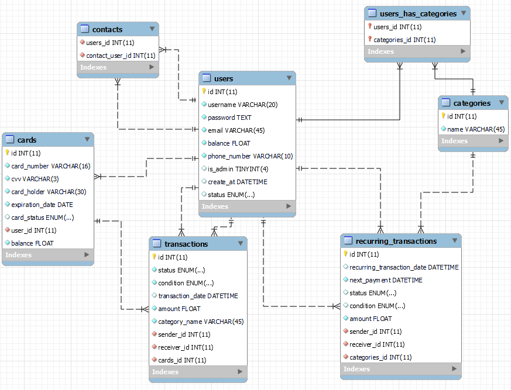

# Virtual Wallet

## 1. Project description
- Virtual Wallet is a web application that enables you to manage your budget. 
- Every user can send and receive money (user to user) and put money in his Virtual Wallet (bank to app).

## 2. Database

## 3. How to Install and Run the Project - changes to follow
- Navigate to /server and open a terminal
- Run `uvicorn main:app`
- Open a browser and type `http://127.0.0.1:8000/docs`. There should be documentation of the available endpoints.